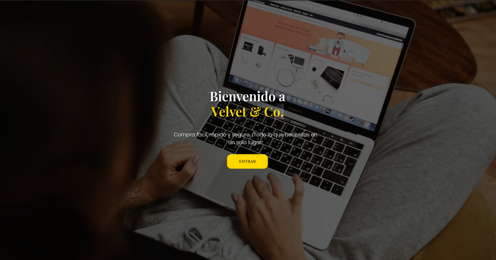
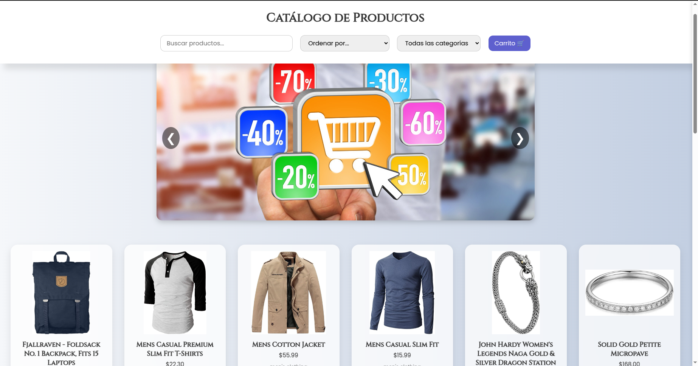

# 🛍️ Velvet & Co - Tienda Web Interactiva

Aplicación web responsive que consume productos desde una API pública, permite la navegación por catálogo, filtrado, ordenamiento, búsqueda y administración de un carrito de compras con persistencia de datos.

## 📸 Capturas de Pantalla

### Pantalla de Inicio


### Vista de Productos


### Carrito Lateral


---

## 🚀 Instrucciones para Ejecutar

1. Clona este repositorio:
   ```bash
   git clone https://github.com/SantiagoRomero7/Velvetco_proyecto
Abre el proyecto en Visual Studio Code o tu editor de preferencia.

Abre el archivo index.html con Live Server o directamente en el navegador.

La pantalla inicial te redirigirá a productos.html donde podrás explorar la tienda.

---

## 🛠️ Tecnologías Utilizadas
- HTML5 y CSS3 (sin frameworks)

- JavaScript ES6+

- Fetch API

- GSAP para animaciones

- LocalStorage para persistencia del carrito

- Responsive Design con media queries
---
## 📦 Estructura del Proyecto

```
velvet-store/
│
├── index.html              ← Pantalla de bienvenida animada
├── productos.html          ← Página principal de productos
├── style.css               ← Estilos generales y específicos
├── main.js                 ← JS para animación de inicio
├── productos.js            ← Lógica principal de tienda y carrito
├── img/                    ← Imágenes 
├── Readme.md                  
└── documentacion/
    └── analisis.md         ← Explicación de decisiones de diseño y estructuras
```
# 👤 Autor
## Santiago Romero

Proyecto individual. 