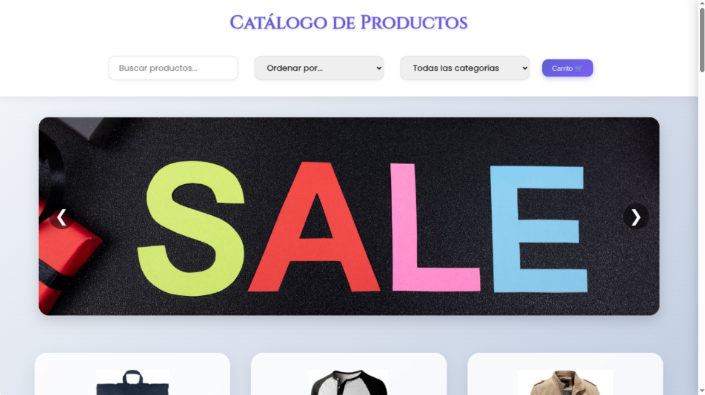
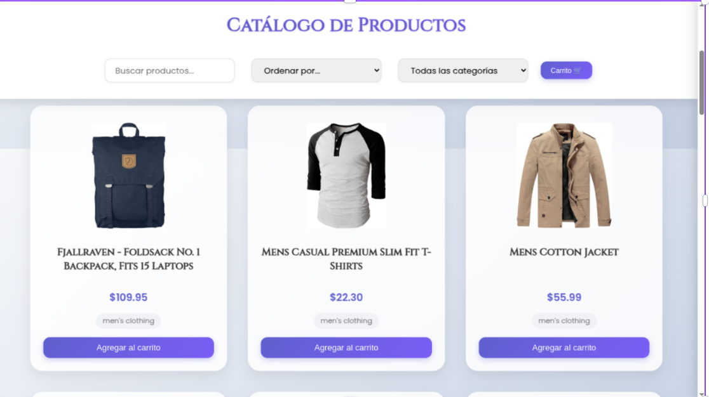
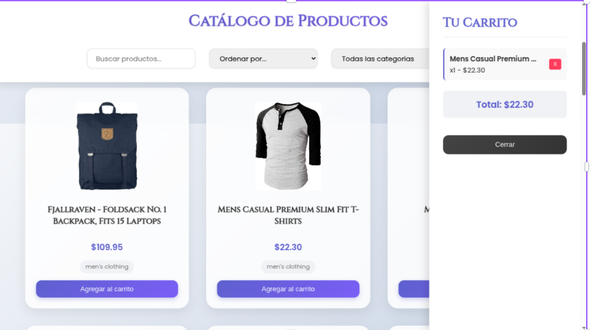

# Análisis de Diseño y Estructura de Datos

## 🧩 1. Decisiones de Diseño de Interfaz y Experiencia de Usuario

Se optó por un diseño visual moderno, limpio y con enfoque en usabilidad móvil y de escritorio. Las decisiones principales fueron:

- **Pantalla de inicio** con video de fondo y llamada a la acción clara ("Entrar").
- **Tipografía personalizada** (Playfair Display, Poppins, Cinzel) para reflejar una identidad elegante.
- **Diseño responsivo** usando media queries, adaptable a móviles, tablets y computadoras.
- **Animaciones visuales (GSAP)** para una experiencia más atractiva y fluida.
- **Carrito lateral** accesible desde cualquier parte de la vista de productos.
- **Componentes intuitivos**: buscador, filtros desplegables, ordenamiento sencillo.

---

# Maquetaciòn 
## Inicio 

## Catalogo productos y carrusel de imagenes

## VIsta previa de los productos 

## Carrito de compras


La maquetación del proyecto fue diseñada principalmente con canva y en el desarrollo se busco una similitud a la maquetaciòn o planeacion previa al desarollo buscando una estructura visual clara y jerárquica que facilita la navegación del usuario.En cuanto al nombre de la tienda, se tenia pensado lunaria, pero mientras se desarrollaba se busco un nombre màs elegante, quedando Velvet&co. Se utilizó una organización semántica en el HTML con secciones bien definidas como el encabezado fijo (con filtros, búsqueda y acceso al carrito), un cuerpo principal con productos dispuestos en cuadrícula responsiva, un carrito accesible en un aside y un footer que aporta cierre visual. Se aplicaron técnicas de maquetación modernas con CSS utilizando Flexbox, Grid y media queries para garantizar una experiencia responsive en dispositivos móviles, tablets y escritorios. Los estilos priorizan la legibilidad, el contraste, la estética moderna y la coherencia con el diseño propuesto, lo que refuerza la usabilidad y mejora la experiencia general del usuario. 

## 📦 2. Estructura de Datos Utilizada

### Productos

Los productos se obtienen dinámicamente desde la API pública [Fake Store API](https://fakestoreapi.com/products), y cada objeto tiene la siguiente estructura:

```json
{
  "id": 1,
  "title": "Nombre del producto",
  "price": 29.99,
  "description": "Descripción",
  "category": "men's clothing",
  "image": "url"
}
```

Los productos se almacenan en un array de JavaScript (productos[]) para poder filtrarlos, ordenarlos y renderizarlos dinámicamente.

## Carrito
El carrito se representa como un array de objetos JavaScript, donde cada objeto incluye el producto completo más la cantidad:
```
carrito = [
  {
    id: 1,
    title: "Nombre del producto",
    price: 29.99,
    quantity: 2,
    image: "url"
  },
  ...
];
```
- Se guarda en el localStorage usando JSON.stringify().

- Al cargar la página, se recupera con JSON.parse() para mantener persistencia.

## 🔍 3. Justificación de Filtros y Ordenamientos
- Desde el punto de vista de usabilidad:

- Filtro por categoría: ayuda al usuario a explorar productos relevantes sin sobrecarga visual.

- Orden por precio (ascendente y descendente): útil para compradores con límite de presupuesto.

- Orden por nombre: mejora la experiencia de búsqueda alfabética o por reconocimiento de marca.

- Barra de búsqueda: permite buscar productos por título o descripción, acelerando la navegación.

- Estas funciones garantizan accesibilidad, rapidez y una experiencia personalizada según las preferencias del usuario.

## 💾 4. Asincronía y Modularidad
- Se utilizó async/await para el manejo de peticiones fetch() a la API.

- Las funciones están modularizadas: obtenerProductos(), renderizarProductos(), aplicarFiltrosYOrden(), etc.

- El archivo productos.js organiza la lógica separada del HTML y CSS, favoreciendo mantenimiento.

## ✅ Conclusión
El proyecto cumple con principios de diseño centrado en el usuario, arquitectura clara y modular, buenas prácticas de almacenamiento local, y un enfoque responsivo para múltiples dispositivos.


